# forum (论坛社区)

### Backend 后端
- Java: 22
- Spring Boot 3.3.2
- Spring Security 6
- Mybatis (mybatis-spring-boot-starter 3.0.3)
- MySQL: 8.0.39

### Frontend 前端
- Thymeleaf
- Bootstrap
- jQuery
- Chart.js
- bootstrap-select
- daterangepicker

### Build Tool 构建工具
- Maven 3.9.8

### Dev Tool 开发工具
- VS Code 1.19.1

### Main Features
- Users:
    1. Registry to the forum member (Email verification is required)
    2. Login to the forum (normal password verification)
    3. Visitor: search and view posts (including comments and hits on posts)
    4. After logging into the forum: posting, commenting, updating profile (basic user information and avatar etc.), and displaying user badges
- Administrator:
    1. Post Management (Create, Edit, and Delete)
    2. User Management (Edit and Delete)
    3. Category Management (create, edit, and delete)
    4. Statisticals

### 主要功能
- 普通用户：
    1. 注册论坛会员（需要邮箱验证）
    2. 登录论坛（普通密码验证）
    3. 游客身份：搜索、浏览贴子（包括能够浏览帖子的评论和帖子的点击次数）
    4. 登录论坛后：发帖、评论、更新资料（用户基本信息和头像等）、显示用户徽章
- 管理员：
    1. 帖子管理（创建、编辑和删除）
    2. 用户管理（编辑和删除）
    3. 分类管理（创建、编辑和删除）
    4. 统计图表

### Security
- Form Validation
- Login Verification
    1. User password Verification
    2. User Authentication (Using Spring Boot Security framework)

### 安全性
- 表单验证
- 登录验证
    1. 用户密码验证
    2. 用户身份认证（使用 Spring Boot 安全框架）

# How It Works 如何运行

### Database Setup
Before deployment, please make sure MySQL database is up and running:

- Default schema name: `forum`
- Default username: `root` 
- Default password: `Zhl@82`

You can also edit database configuration in `src/main/resources/application.properties` on your own.

### STMP Email Service
Email verification NOT up yet.

### Run through VS Code:
```
git clone https://github.com/Zhaohl2017/protech-forum.git
cd forum
./mvnw spring-boot:run
```
Server can be accessed on http://localhost:8081.

# Overview 整体架构图
### Forum Functional Overview 整体功能架构图


### Forum Development Overview 整体开发架构图
.pdf)

# Database Schema 数据库设计
### ER Digram ER模型


# Screenshots 截图
### Homepage Visitor 游客主页
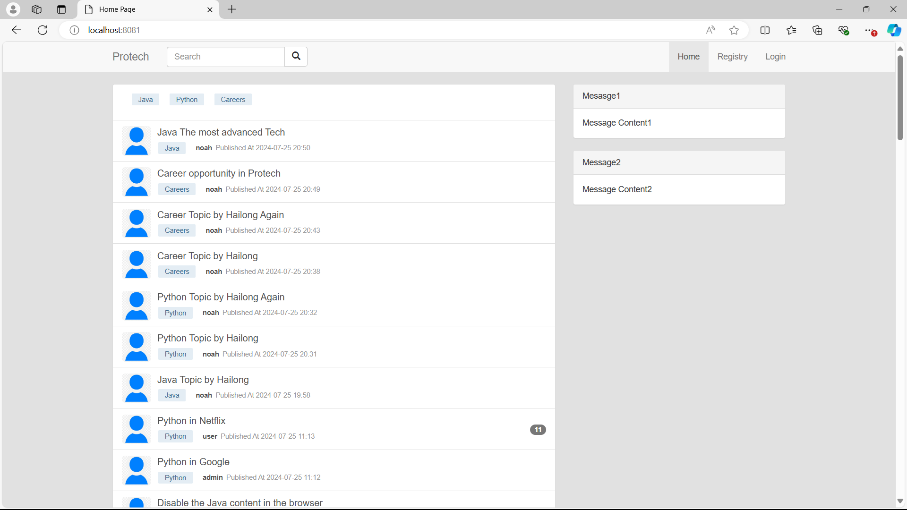

### Search Posts 搜索帖子
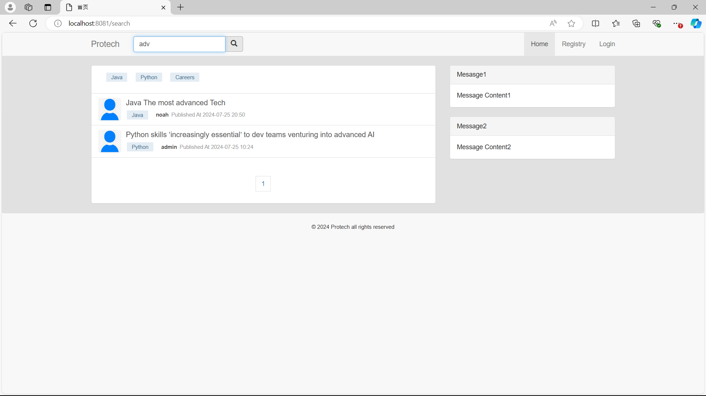

### View Posts 浏览帖子
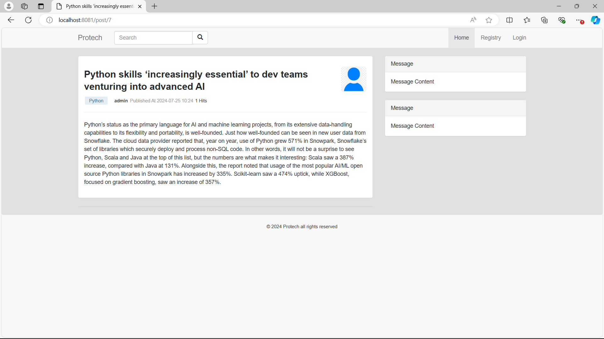

### Registration 注册论坛会员
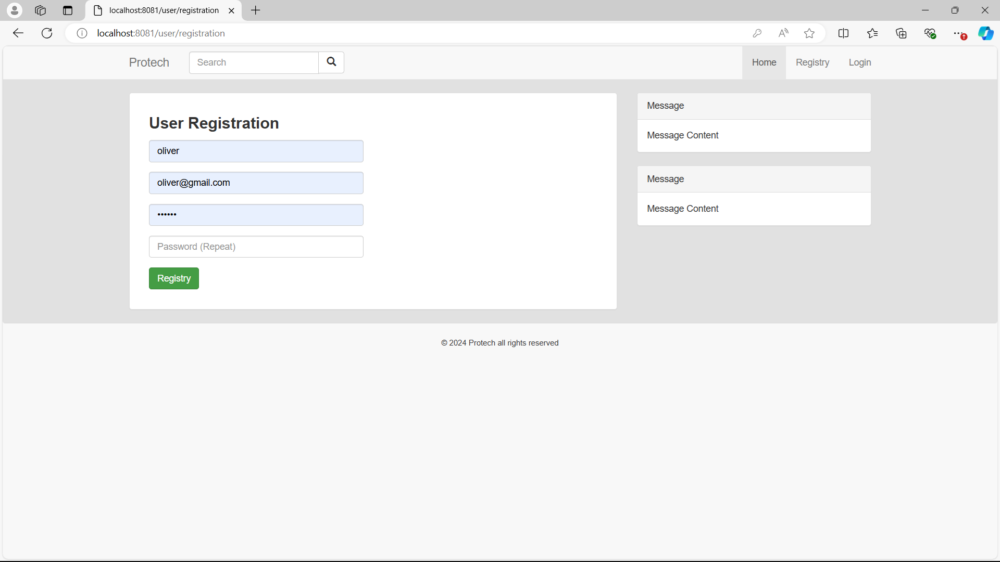

### Login 登录论坛
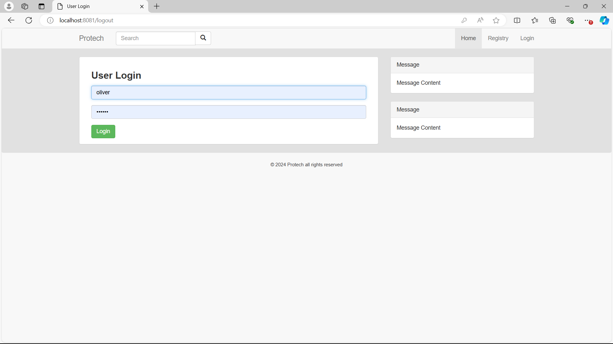

### Homepage User 用户主页
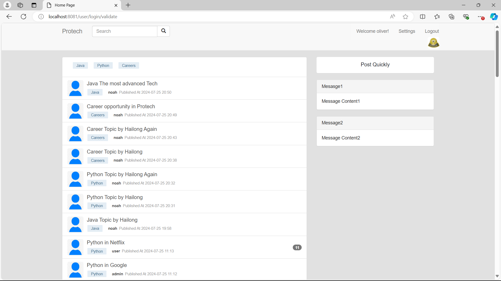

### Publish Post 发帖
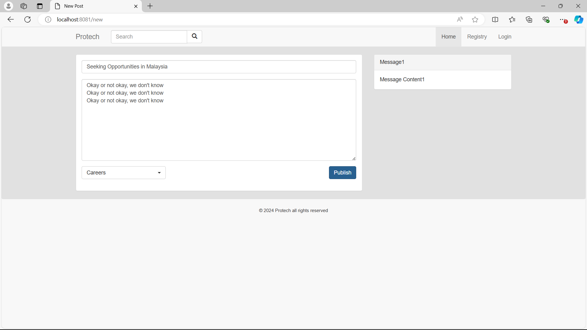

### Publish Post Validation 发帖验证
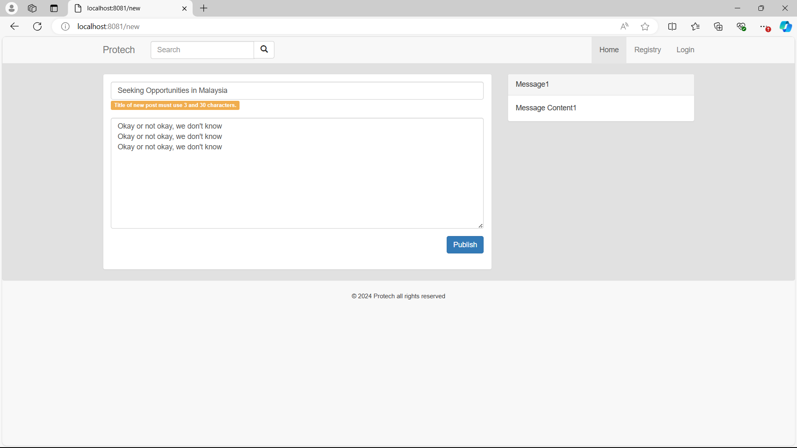

### Comment Post 评论帖子
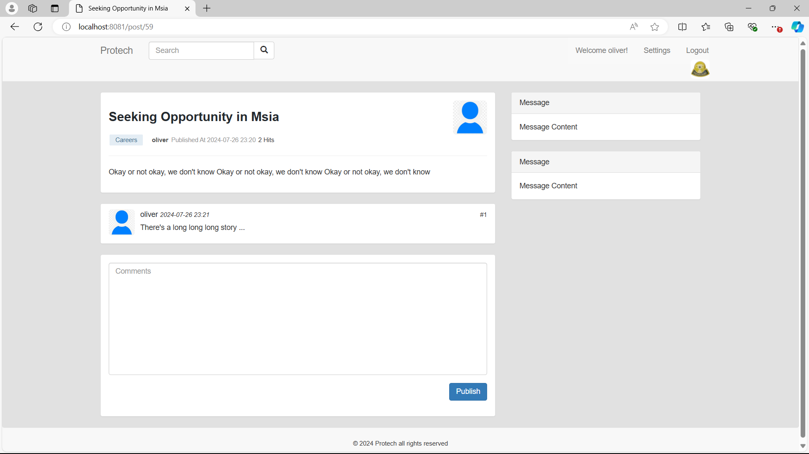

### Edit User Profile 修改用户资料
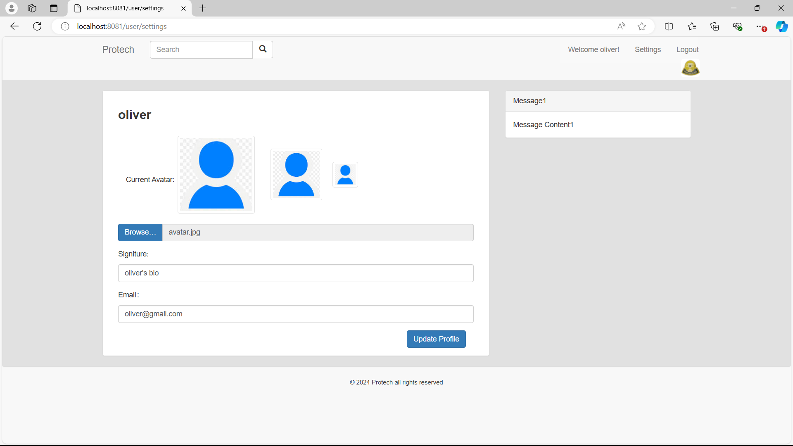

### Homepage Admin 管理员主页
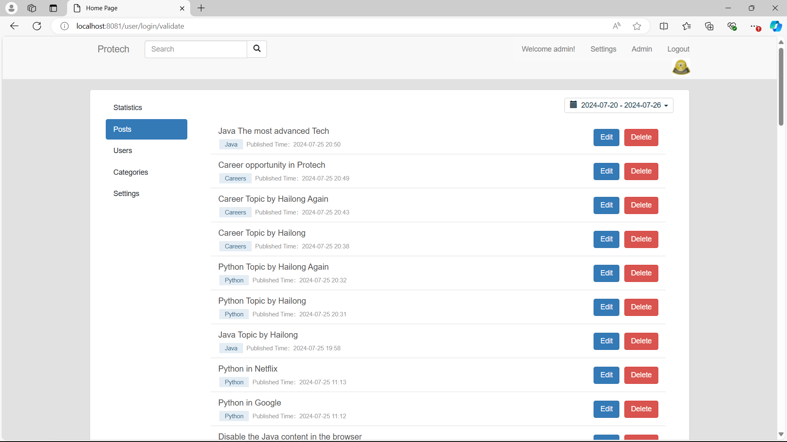

### Post Management 帖子管理
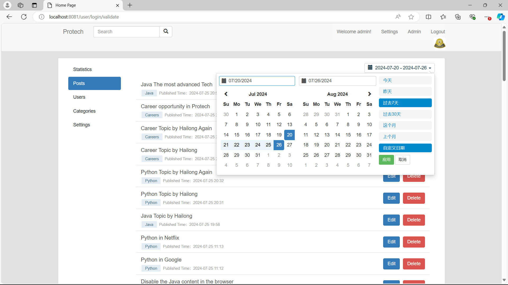

### Edit Post 编辑帖子
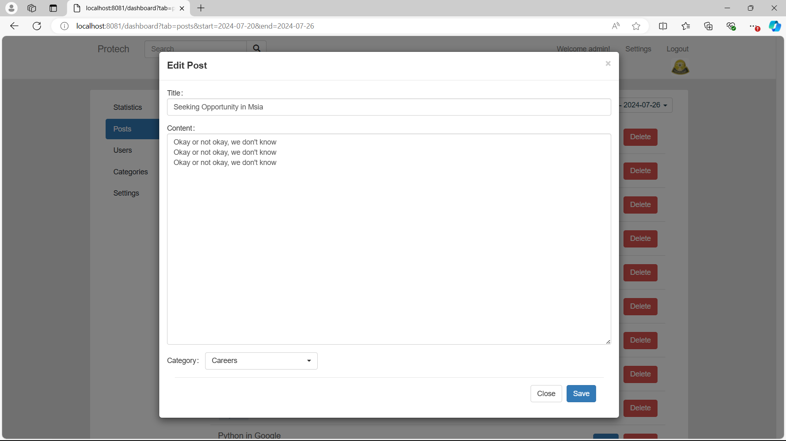

### Delete Post Confirmation 删除帖子确认
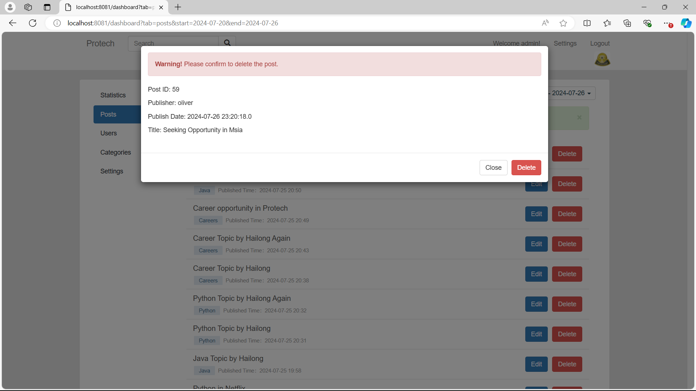

### User Management 用户管理
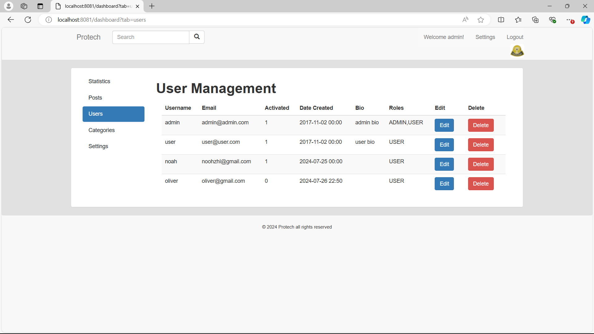

### Edit User Information 修改用户
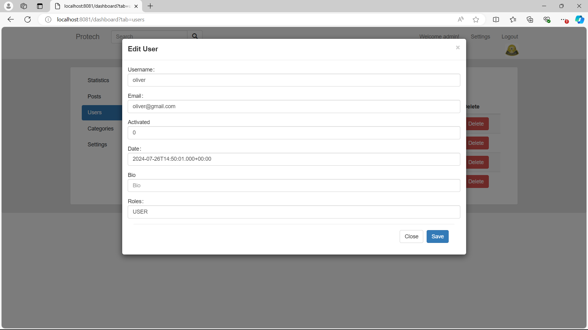

### Delete User Confirmation 删除用户确认


### Edit Admin Profile 修改管理员资料


### Statistic Charts 统计图表
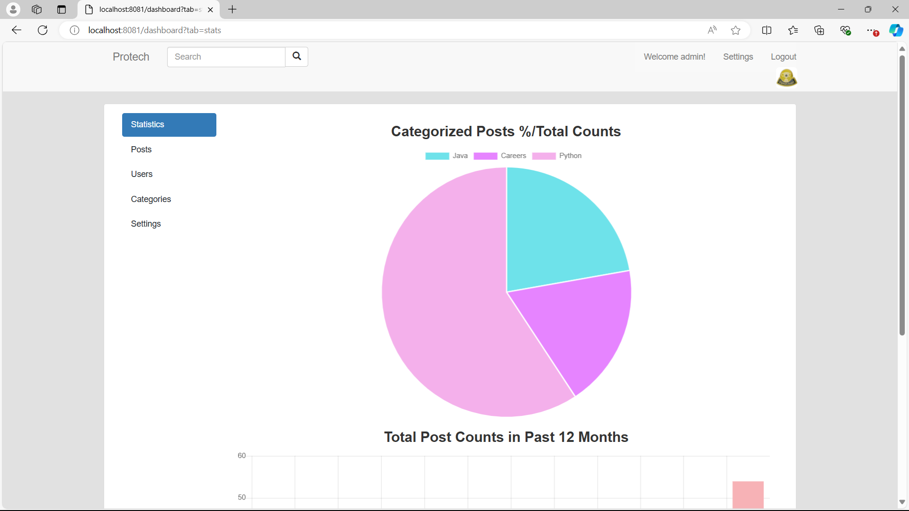

### Authentication 用户身份认证
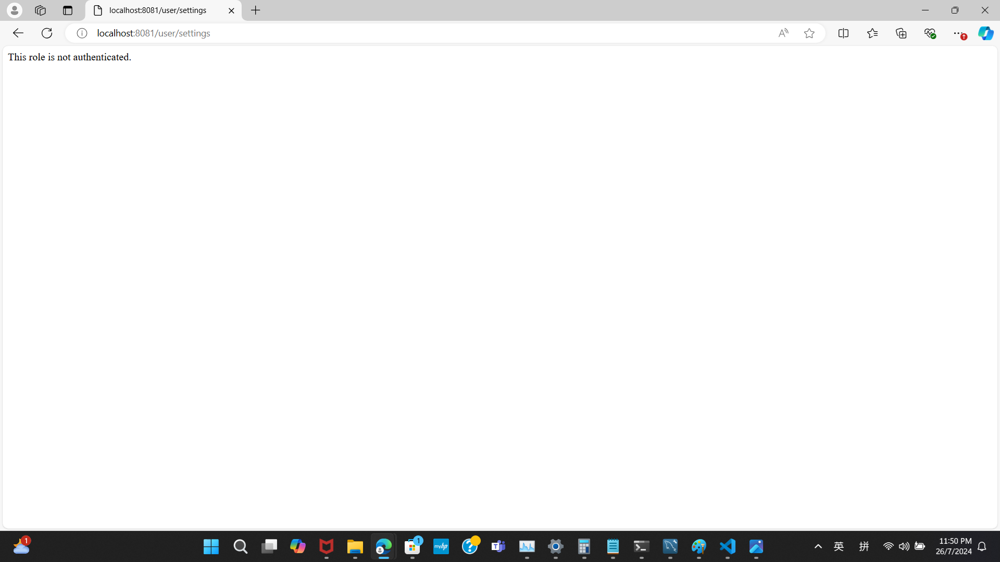
